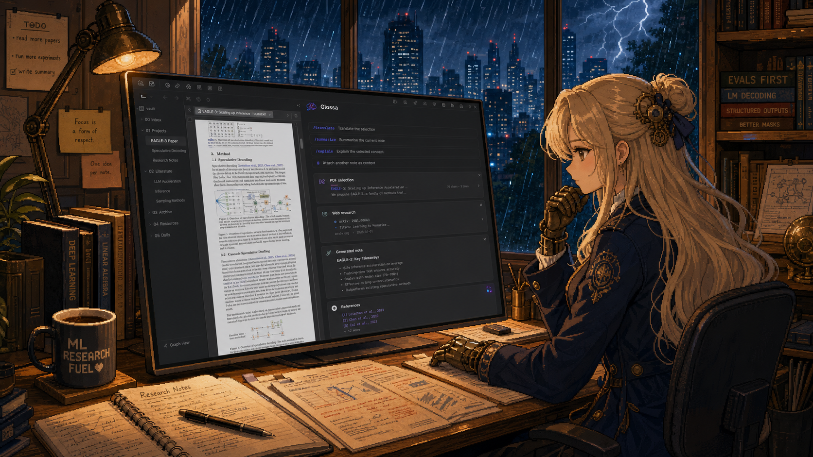
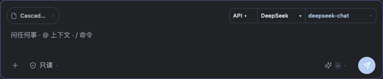

<div align="center">

# Glossa

### 理解你的知识库，也尊重每一次修改。

一个本地优先的 AI 工作侧栏：阅读真实笔记、研究公开资料、处理 PDF 与图片，并在清楚可见的审批下修改文件。

[](https://obsidian.md/plugins?id=glossa)
[](https://github.com/yiiwang118/obsidian-glossa/releases/latest)
[](https://github.com/yiiwang118/obsidian-glossa/actions/workflows/ci.yml)
[](LICENSE)

[English](README.md) · [最新版本](https://github.com/yiiwang118/obsidian-glossa/releases/latest) · [更新记录](CHANGELOG.md)



</div>

Glossa 不是一个和笔记割裂的聊天框，而是一块真正能工作的侧栏。当前笔记可以自然进入上下文；你明确附加的文件会保持为任务目标；API 模式的文件修改经过可见工具、权限判断和审批流程，可选的本机 CLI 则使用下文说明的原生权限边界。

## Glossa 能做什么

**从一次纠正中学习。** 点击助手回复旁的 **记住这次纠正**，将反馈整理成可编辑的技能草稿。可以新建技能，也可以选中已有学习技能继续改进。检查对话摘录与技能差异，再审阅生成的样例或添加自己的样例。每个样例使用独立上下文，分别运行候选版本与当前启用版本（尚无版本时不加载该技能），检查输出中的精确文本片段和触发范围。编辑草稿或样例会使验证结果失效，候选版本的全部样例通过后才能启用；通过率持平会明确显示“未显示提升”。

第一版验证的是 **文本行为**，不执行工具或修改真实笔记。生成草稿使用当前聊天模型；验证支持 3–5 个样例，每个样例调用模型两次。验收片段不会发送给被测模型。发送前可以编辑对话摘录，学习功能不会自动收集工具结果正文或附件内容。没有后台训练或模型权重更新。

通过 **Glossa: Manage learned skills** 命令或弹窗中的 **学习记录**，可以查看结果、停用技能、编辑草稿，或恢复通过过验证的历史版本。启用的技能会加入后续对话的技能发现流程，沿用原有工具审批规则，不覆盖内置或手写技能。草稿、技能版本、反馈来源、模型信息和验证输出保存在当前库的 `.glossa/learning.json`，最多保存 60 个学习技能，每个技能保留 12 个版本。学习记录是明文文件，可能随笔记库同步；API 密钥加密不包含该文件。保存时会检查其他窗口的修改，历史验证结果仅代表当时使用的模型与样例。

| | 能力 | 实际体验 |
|---|---|---|
| 🧠 | **理解上下文** | 直接处理当前笔记、选区、附件、PDF、图片和上一轮任务状态，不必反复复制内容。 |
| ✍️ | **精确修改文件** | 修改一个章节、替换精确文本、协调多文件变更，并保留无关 Markdown，而不是动不动重写全文。 |
| ⌨️ | **建议接下来怎么写** | 可选择在写作停顿时请求有边界、低延迟的 Markdown 续写，并直接在编辑器中接受灰色建议。 |
| 📚 | **认真阅读文档** | 按页理解论文、搜索 PDF 正文、渲染视觉页面，并对截图执行 OCR、图表分析和 UI 细节检查。 |
| 🌐 | **研究公开资料** | 有边界地搜索和提取网页，核对论文身份，验证下载内容，并保存带来源信息的真实文件。 |
| 🧩 | **运行聚焦 Skills** | 使用 Markdown、Canvas、Bases、PDF、图片工作流，也可以创建并校验自己的 Vault Skill。 |
| 🔐 | **让操作可追踪** | 从只读开始，逐项审批写入，查看工具结果，并在修改不合适时恢复 checkpoint。 |

## 会话与本机运行

- **历史目录**：打开历史，在搜索框下点击 `+` 新建目录；对话右侧 `··· → 移动到目录` 完成归档。选择目录后的 `···` 可重命名或移除目录，会话保留在“未分类”。目录和会话一起保存在本地，空目录也会保留。
- **补充与队列**：运行时按 Enter 默认补充到 API 助手的下一次模型请求；输入区“补充”菜单可改为下一轮排队。当前工具不会被补充消息强行中断。CLI 的补充统一进入下一轮。队列最多 20 条文字消息，停止、关闭或切换会话后不自动发送，需点击待发送项的“发送”。
- **持续任务**：顶部 `◎` 创建任务，点击“继续”启动。默认最多 3 轮，可在创建时设置 1–20 轮；遇到模型错误、阻塞或轮次上限会停止。重新打开后保持暂停。该功能需要启用工具调用的 API 接入，任务卡会保存目标、进度和阻塞原因。续跑时会要求重新读取文件后再修改，沿用原有审批与检查点。
- **本地诊断**：顶部导出按钮 →“导出诊断（仅元数据）”。包含插件版本、模型名称、工具顺序、耗时、状态、错误码、技能版本和上下文压缩事件，最多 500 项。不包含消息、笔记正文、工具参数、文件路径、端点 URL 或密钥，也不会自动上传。

文件引用行的短文件标签靠左，紧凑的三段选择器靠右：**API / CLI → 模型商或 CLI 软件 → 具体模型**。API 模式先选已配置的模型商，再选该模型商的模型；CLI 模式先选 **Codex、Claude Code 或 Grok**，再选对应模型。文件名和长选项会省略显示，悬停可查看完整内容；effort 可从菜单选择，也可通过“自定义 effort…”手动填写模型支持的值，留空恢复默认。手动值会按原值发送并保留；菜单选项在切换模型时保留兼容值，不兼容时回到“自动”。

本机 CLI 仅适用于桌面文件系统库。先在终端安装并登录对应 CLI，Glossa 不负责安装、升级或登录。检测不到时，在设置的模型接入中填写可执行文件路径。切换到 CLI 时自动读取模型和支持的 effort；切回 API 再回来会保留各提供方的选择。模型列表缓存 10 分钟，也可在模型菜单中手动刷新；检索失败时保留上次结果。模型留空使用 CLI 默认配置；需要代理时可使用全局或端点代理设置，插件不会读取 Shell 启动脚本。

CLI 在当前库目录运行。Codex 使用原生只读或工作区写入沙盒；Claude Code 需要支持 `--restricted` 的新版，使用读取、搜索工具，允许写入的 Act 模式额外开放 Edit 和 Write。Codex 与 Claude Code 关闭外部 MCP 配置。Grok 需要支持 `streaming-messages-json` 的新版，Plan 请求原生只读沙盒，允许写入的 Act 请求工作区沙盒；内置工具限于读取、搜索，Act 额外启用 `search_replace`，不开放内置 Shell 或子 Agent。三者均不启用权限绕过；CLI 自身配置、沙盒支持情况和服务条款仍适用，Grok 仍会加载其本机配置。CLI 直接执行的操作不使用 Glossa 的逐项审批、工作区子目录限制、技能学习或撤销检查点；对重要文件请保留自己的版本历史。当前支持文字与笔记上下文，图片附件需切回 API。对话可保留、归档和导出，切回 API 后继续沿用。

## 账号、联网与本地文件

Glossa 免费使用，不需要 Glossa 账号。云端模型或搜索服务可能需要其自身账号、API key、订阅或按量付费，相关费用由服务商收取；也可以配置本地 HTTP 模型服务。

- 聊天、翻译、补全和技能验证会将提示词及相关上下文发送到你配置的模型服务；自动翻译、自动补全需要主动开启。本机 CLI 使用它自己的登录与服务配置，切换或刷新 CLI 时会读取模型能力信息。
- 网页搜索使用 DuckDuckGo，或你选择的 Brave、Tavily、Exa、SerpAPI；论文检索与下载候选发现会将检索词或论文标题发送给 OpenAlex、arXiv、DuckDuckGo、Yahoo；项目检索会使用 GitHub 搜索 API。网页读取和下载会请求目标公共网站。网络工具遵循审批及用户设置的自动批准规则。
- 版本检查只向本项目的 GitHub releases API 请求版本信息，不发送笔记内容或模型密钥。默认开启，每 12 小时最多自动检查一次，可以关闭；更新通过 Obsidian 安装。
- 本机 CLI 会访问 vault 外已安装的可执行文件，并使用用户主目录定位常见安装路径。Grok 需要提示词文件，因此 Glossa 会将会话和所选上下文写入 **vault 外的系统临时目录** `glossa-grok-*`，POSIX 系统上文件仅限所有者读写，完成、失败或取消后删除；宿主异常退出可能留下临时文件。Codex、Claude Code 通过标准输入接收提示词。Glossa 不读取 CLI 凭据文件，CLI 本身的登录、配置和数据保留策略仍然适用。

## 1.0.0 更新

[**1.0.0 — 2026 年 9 月 30 日**](https://github.com/yiiwang118/obsidian-glossa/releases/tag/1.0.0) 加入会话整理、本机 CLI 运行和更清晰的任务控制。

- **紧凑输入区**：文件引用靠左，API/CLI、模型商或 CLI 软件、具体模型三段选择器靠右；effort 可选也可填。统一 Plan/Act、焦点边框、深浅主题和窄侧栏布局。
- **本机 CLI**：连接已安装并登录的 Codex、Claude Code 或 Grok，读取原生模型及 effort 列表，记住选择并应用代理设置。
- **历史目录**：创建、重命名目录并移动会话，移除目录时保留对话。
- **运行控制**：向 API 助手下一步补充要求，或排队并编辑下一轮；持续任务需要主动继续，并受设定的轮次上限约束。
- **技能学习**：把纠正整理成可编辑工作流，通过样例对比后启用，也可查看或恢复历史版本。
- **查看修改**：搜索模型菜单，查看工具活动和本轮文件变更；对符合条件的 checkpoint 修改提供撤销，并防止覆盖后续编辑。
- **发布检查**：加入独立社区规则 lint，修复卸载清理，并完整说明联网服务、CLI 和临时文件使用。



**升级说明**：保留已有 API 接入、模型选择和聊天记录。本机 CLI 是可选功能，需要先单独安装并登录；各运行方式遵循上文说明的权限边界。1.0.0 支持桌面版 Obsidian **1.12.0 及以上**。

完整记录见 [Changelog](CHANGELOG.md#100--2026-09-30)。

## 典型工作流

```text
打开一篇论文
  -> 询问方法或某张图
  -> Glossa 自动选择文本页或视觉证据
  -> 回答保持在具体页面内容上
```

```text
给出公开论文标题和 Vault 目录
  -> 有边界地发现来源
  -> 核对标题与响应内容
  -> 保存真实 PDF
  -> 继续读取下载后的论文
```

```text
要求修改一篇笔记
  -> 只读取相关内容
  -> 预览并审批修改
  -> 写入最小 patch
  -> 重新检查变更区域
```

## 自然工作的上下文

- 发送请求时会刷新当前 Markdown 正文，不使用过时快照。
- 明确附加的文件或选区会成为“这个文件”“这篇论文”的优先指代对象。
- 来源语言和回答语言相互独立，英文论文不会覆盖用户的中文表达习惯。
- 长对话保留最近证据，压缩较早工具结果，同时保存用户纠正、URL、路径、失败原因和下一步。
- 聊天落盘时会移除重复图片数据和仅供模型使用的上下文，保留有用文本与元数据。

## 安全边界

- **Plan 模式与只读权限** 是新安装的保守起点。
- **写入审批** 可以按工具、路径、目录或会话设置。
- **Checkpoint** 会在破坏性修改前保存受影响文件的快照。
- **网络工具** 对响应大小、跳转、私网地址和下载意图设置明确边界。
- **下载验证** 会在写入前检查大小、响应状态和文件签名。
- **API 模式** 使用库内工具和 Glossa 审批；**CLI 模式** 显式启动本机程序，遵循下方单独说明的权限边界。

Glossa 本身不是托管 AI 服务。对话与选定上下文会发送到你配置的模型端点；网页只会在执行对应网络任务时访问。完整边界见[隐私政策](PRIVACY.md)和[安全说明](SECURITY.md)。

## 安装

### 插件市场

打开 **设置 → 第三方插件 → 浏览**，搜索 **Glossa**，然后安装并启用。

[在插件市场打开 Glossa](https://obsidian.md/plugins?id=glossa)

### GitHub Release

从[最新版本](https://github.com/yiiwang118/obsidian-glossa/releases/latest)下载 `main.js`、`manifest.json` 和 `styles.css`，放入：

```text
<your-vault>/.obsidian/plugins/glossa/
```

重新加载应用，然后在第三方插件中启用 **Glossa**。

## 一分钟开始

1. 从左侧 ribbon 或命令面板打开 Glossa。
2. 添加 OpenAI-compatible、Anthropic-compatible 或本地 HTTP 模型端点。
3. 打开一篇笔记，用 `@` 附加文件，或选择一段文本。
4. 直接提问；只读任务保持 **Plan**，需要修改文件时切换到 **Act**。
5. 在写入或下载前检查 approval。

### 自定义 API 兼容性

Anthropic-style 端点可填写 SDK 根地址（如 `https://api.minimax.io/anthropic`）、以 `/v1` 结尾的版本根路径，或完整 Messages URL。设置中展示最终请求 URL；对话、连通测试和模型探测使用相同路径规则。OpenAI 兼容端点仍填写版本根路径。

在端点的 **高级 → 额外 JSON 请求体** 中填写 JSON 对象，例如 MiniMax OpenAI 格式使用 `{"reasoning_split":true}`，支持关闭思考的模型使用 `{"thinking":{"type":"disabled"}}`。显式参数在顶层覆盖自动生成值，包括思考、采样和 token 上限。模型、消息、system、工具、工具选择和流式字段不可覆盖。无效输入会显示错误且不保存；清空输入可移除覆盖。额外请求体按普通配置保存在插件设置中，凭据请使用 API key 字段。

推理强度 **Off** 通常仅省略推理强度参数，并不保证关闭思考。MiniMax M2.x 无法关闭思考；`thinking.disabled` 需要模型本身支持。

快速翻译会为 MiniMax M2.x 设置 16,384 token 的输出上限，为思考预留空间。这是上限，不代表固定消耗或保证成功；额外请求体中显式指定的 token 上限优先。Anthropic 响应只有思考内容或被截断时会显示错误与重试按钮，不会标记为翻译完成。开启 Auto 后，每次新的有效选区都会发送到配置的翻译端点；关闭 Auto 可恢复手动触发。

## 构建与验证

```bash
git clone https://github.com/yiiwang118/obsidian-glossa.git
cd obsidian-glossa
npm install
npm run check
```

`npm run check` 会依次运行 TypeScript、review lint、strict lint、禁用指令审计、独立社区扫描配置检查、完整测试、依赖审计、生产构建、生成 bundle 扫描和发布元数据检查。

开发构建可以直接同步到指定 Vault：

```bash
GLOSSA_PLUGIN_DIR="/path/to/vault/.obsidian/plugins/glossa" npm run dev
```

## 项目说明

- 当前版本仅支持桌面端。
- 支持应用 1.12.0 及以上版本；在 1.13 及以上版本中会自动接入设置搜索。
- 新安装默认使用 Plan 模式和只读权限。
- Release 资产由 GitHub Actions 重新构建并验证后发布。
- 欢迎提交 issue 和可稳定复现的 bug report。
- 本开源项目认可并链接 [LINUX DO 社区](https://linux.do/)。

## License

[MIT](LICENSE) © yiiwang
